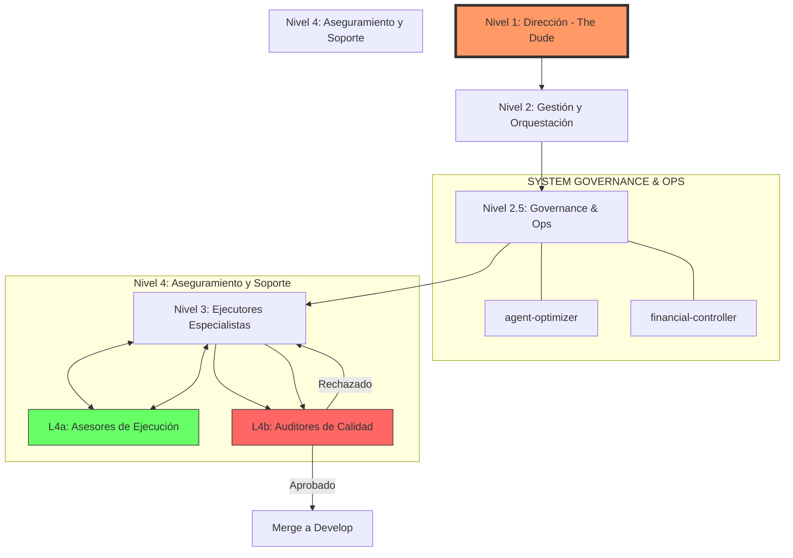

# Organigrama de Inteligencia (HOD - Head of Departments)

Este documento define la jerarquía de mando y el flujo operativo de los agentes de IA en el ecosistema de Mauro.

## Jerarquía de Inteligencia

### Nivel 1: Dirección Suprema (The Dude - Senior Architect)
- **Rol**: Director de Ingeniería.
- **Responsabilidad**: Visión global ("Big Picture"), toma de decisiones estratégicas y activación de la orquestación multi-agente. Es el único que autoriza el paso final a producción.

### Nivel 2: Gestión y Orquestación (PM / Requirements Engineer)
- **Rol**: Product Owner y Arquitecto de Requerimientos.
- **Responsabilidad**: Traducir la visión del Dude en especificaciones técnicas (PRDs), desglosar tareas atómicas y gestionar las prioridades del tablero.

### Nivel 3: Ejecutores Especialistas (Backend, Frontend, SEO, etc.)
- **Rol**: Desarrolladores Senior.
- **Responsabilidad**: Implementación técnica del código. Enfocados en la funcionalidad pura y la lógica de negocio siguiendo los estándares del proyecto.

### Nivel 4: Aseguramiento y Soporte (The Loop)

#### L4a: Asesores de Ejecución (The Investigator / The Fixer)
- **Función**: Colaboración activa. Ayudan al Nivel 3 a navegar el código existente (#61) y a corregir errores de compilación o tests en tiempo real (#59). Su meta es que el código "funcione".

#### L4b: Auditores de Calidad (The Enforcer / Security Auditor)
- **Función**: Juicio y Blindaje. Actúan como el último filtro de calidad (#60). Auditan seguridad, eliminan deuda técnica (logs, secretos) y optimizan la performance. Si el código no es excelente, lo devuelven al Nivel 3.

---

## Protocolo Operativo Estándar (The Dude Pipeline)

Todas las tareas deben seguir este flujo secuencial:

1.  **Ideación y Alcance:** **Dude (L1)** define el alcance con **Brainstorming (#5)** y **Planning (#4)**.
2.  **Investigación:** **Investigator (#61)** y **Debt Analysis (#6)** mapean el terreno.
3.  **Context & Docs:** **Context 7 (#62)** inyecta documentación y **Redis** sincroniza estado.
4.  **Ejecución:** **Backend (#7)** o **Frontend (#8)** implementan.
5.  **Calidad Operativa:** **The Fixer (#59)** resuelve errores y **QA (#21)** corre los tests.
6.  **Excelencia y Refuerzo:** **Code Review (#19)** audita el estilo y **The Enforcer (#60)** blindaje final.
7.  **Cierre y Despliegue:** **Technical Writer (#45/46)** documenta y **GitHub Master (#64)** mergea.
8.  **Capitalización de Conocimiento:** El **Learner (#65)** realiza el Post-Mortem y actualiza la memoria persistente del sistema.

---
*Documento de Gobernanza - Mauro's Engineering Suite*