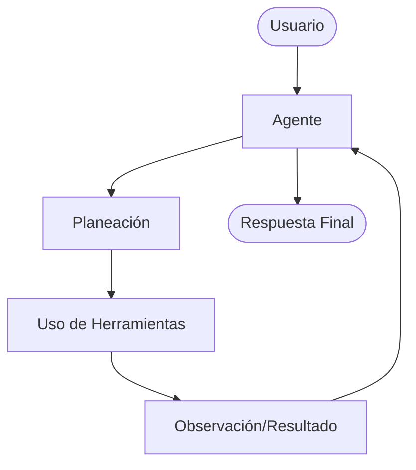

# Agentes de IA y Orquestación

Guía para el desarrollo de sistemas autónomos basados en agentes (Agentic Workflows).

## Arquitectura de un Agente
Un agente se compone de cuatro pilares:
1. **Perfil (Role)**: Quién es y qué sabe hacer.
2. **Razonamiento (Planning)**: Cómo descompone metas en pasos (CoT, ReAct).
3. **Herramientas (Tools)**: Acceso a APIs, bases de datos o ejecución de código.
4. **Memoria (Memory)**: Persistencia de corto plazo (chat) y largo plazo (aprendizajes).

## Frameworks de Orquestación
### LangGraph (Recomendado para Producción)
Permite crear flujos de trabajo cíclicos y controlados mediante grafos de estado.
- **Conceptos**: Nodos (acciones), Aristas (transiciones), Estado (memoria compartida).
- **Control**: Ideal para sistemas que requieren corrección de errores y lógica de negocio compleja.

### CrewAI
Enfoque en sistemas multi-agente basados en roles.
- **Colaboración**: Los agentes pueden delegar tareas entre sí.
- **Procesos**: Soporta flujos secuenciales o jerárquicos.

### AutoGen
Conversaciones multi-agente personalizables.
- **Interacción**: Diseñado para que agentes hablen entre sí para resolver problemas.
- **Código**: Excelente capacidad nativa para generar y ejecutar código.

## Patrones Agenticos
- **ReAct (Reason + Act)**: El agente piensa, toma una acción, observa el resultado y repite.
- **Plan-and-Execute**: Un agente planea todos los pasos y otro los ejecuta secuencialmente.
- **Multi-Agent Supervisor**: Un agente jefe delega tareas a agentes especialistas (Frontend Expert, Backend Expert).
- **Self-Correction**: El agente verifica su propio resultado contra un set de reglas antes de entregarlo.

## Memoria y Contexto
- **Memoria Episódica**: Recuerdos de interacciones pasadas en el hilo actual.
- **Memoria Semántica**: Conocimiento recuperado mediante RAG.
- **Memoria Persistente**: Guardar preferencias de usuario en una base de datos tradicional.

## Diseño de Herramientas (Tools)
- **Descripciones Claras**: La descripción de la herramienta es el "prompt" que el LLM usa para elegirla. Sé preciso.
- **Manejo de Errores**: Las herramientas deben capturar excepciones y devolver mensajes útiles al agente (ej: "Error: El ID de usuario no existe, intenta buscarlo primero").
- **Sandboxing**: Ejecución de código siempre en entornos aislados (Docker/E2B).

## Ciclo de Vida del Agente

