# Playbook Engine - Arquitectura del Sistema

## Diagrama de Arquitectura

```mermaid
graph TB
    subgraph "Interfaz de Usuario"
        UI[Consola/CLI/REST API]
        UI -->|Crear/Consultar| PE
        UI -->|Aprobar/Rechazar| AG
        UI -->|Monitorear| MD
    end

    subgraph "Playbook Engine Core"
        PE[Playbook Engine]
        PE -->|Ejecuta| SE[Skill Engine Master]
        PE -->|Registra Métricas| MD
        PE -->|Verifica Costos| CT
        PE -->|Solicita Aprobación| AG
        PE -->|Gestiona Rollback| RM

        subgraph "Validación"
            V1[Schema Validator]
            V2[Dependency Checker]
            V3[Cost Estimator]
        end

        subgraph "Ejecución"
            E1[Stage Executor]
            E2[Concurrent Runner]
            E3[Error Handler]
        end

        PE --> V1
        PE --> V2
        PE --> V3
        PE --> E1
        PE --> E2
        PE --> E3
    end

    subgraph "Sistemas de Soporte"
        CT[Cost Tracker]
        AG[Approval Gateway]
        RM[Rollback Manager]
        MD[Metrics Dashboard]

        CT -->|Cost Data| MD
        AG -->|Approval Data| MD
        RM -->|Rollback Data| MD

        subgraph "Cost Tracker"
            CT1[Real-time Tracker]
            CT2[Budget Monitor]
            CT3[Cost Reporter]
        end

        subgraph "Approval Gateway"
            AG1[Policy Engine]
            AG2[Notification System]
            AG3[Approval Manager]
        end

        subgraph "Rollback Manager"
            RM1[Strategy Planner]
            RM2[Rollback Executor]
            RM3[Recovery Monitor]
        end

        subgraph "Metrics Dashboard"
            MD1[Real-time Metrics]
            MD2[Alert System]
            MD3[Performance Analytics]
        end

        CT --> CT1
        CT --> CT2
        CT --> CT3
        AG --> AG1
        AG --> AG2
        AG --> AG3
        RM --> RM1
        RM --> RM2
        RM --> RM3
        MD --> MD1
        MD --> MD2
        MD --> MD3
    end

    subgraph "Integraciones Externas"
        SE -->|Skills| SK[Skill Registry]
        SE -->|Agents| AO[Agent Optimizer]
        SE -->|Infrastructure| IC[Infrastructure Core]
        CT -->|Cost Data| CC[Cost Control]
        AG -->|Notifications| N1[Telegram]
        AG -->|Notifications| N2[Email]
        AG -->|Notifications| N3[Webhook]
        MD -->|Metrics| M1[Prometheus]
        MD -->|Alerts| A1[Slack]
        MD -->|Alerts| A2[PagerDuty]
    end

    subgraph "Almacenamiento"
        S1[Playbook Definitions]
        S2[Execution Logs]
        S3[Cost History]
        S4[Approval Records]
        S5[Rollback Plans]
        S6[Metric Data]

        PE --> S1
        PE --> S2
        CT --> S3
        AG --> S4
        RM --> S5
        MD --> S6
    end

    %% Estilos
    classDef core fill:#e1f5fe,stroke:#01579b,stroke-width:2px
    classDef support fill:#f3e5f5,stroke:#4a148c,stroke-width:2px
    classDef external fill:#e8f5e8,stroke:#1b5e20,stroke-width:2px
    classDef storage fill:#fff3e0,stroke:#e65100,stroke-width:2px

    class PE,V1,V2,V3,E1,E2,E3 core
    class CT,AG,RM,MD support
    class SK,AO,IC,CC,N1,N2,N3,M1,A1,A2 external
    class S1,S2,S3,S4,S5,S6 storage
```

## Componentes Principales

### 1. Playbook Engine (Núcleo)
- **Schema Validator**: Valida la estructura y contenido de los playbooks
- **Dependency Checker**: Verifica dependencias entre etapas y skills
- **Cost Estimator**: Estima costos antes de la ejecución
- **Stage Executor**: Ejecuta etapas de manera secuencial o concurrente
- **Concurrent Runner**: Gestiona la ejecución paralela de skills
- **Error Handler**: Maneja errores y excepciones durante la ejecución

### 2. Cost Tracker
- **Real-time Tracker**: Monitorea costos durante la ejecución
- **Budget Monitor**: Verifica límites de presupuesto
- **Cost Reporter**: Genera reportes de costos y análisis

### 3. Approval Gateway
- **Policy Engine**: Evalúa políticas de aprobación automáticas
- **Notification System**: Envía notificaciones a aprobadores
- **Approval Manager**: Gestiona flujos de aprobación y decisiones

### 4. Rollback Manager
- **Strategy Planner**: Determina estrategias de rollback
- **Rollback Executor**: Ejecuta operaciones de reversión
- **Recovery Monitor**: Supervisa la recuperación post-rollback

### 5. Metrics Dashboard
- **Real-time Metrics**: Métricas en tiempo real de ejecución
- **Alert System**: Sistema de alertas configurables
- **Performance Analytics**: Análisis de rendimiento y tendencias

## Flujos de Trabajo

### Flujo de Ejecución Normal
1. **Validación**: El playbook es validado contra el esquema
2. **Estimación**: Se calculan costos y dependencias
3. **Aprobación**: Si es requerido, se solicita aprobación
4. **Ejecución**: Se ejecutan las etapas en orden
5. **Monitoreo**: Se registran métricas y costos
6. **Finalización**: Se reporta el resultado

### Flujo de Aprobación
1. **Evaluación**: Se evalúan políticas automáticas
2. **Notificación**: Se notifica a los aprobadores
3. **Decisión**: Los aprobadores toman decisiones
4. **Quórum**: Se verifica el quórum necesario
5. **Continuación**: Se continúa o se detiene la ejecución

### Flujo de Rollback
1. **Detección**: Se detecta un fallo o condición de rollback
2. **Planificación**: Se determina la estrategia de rollback
3. **Ejecución**: Se ejecutan operaciones de reversión
4. **Verificación**: Se verifica la recuperación exitosa
5. **Reporte**: Se reporta el estado del rollback

## Integraciones Clave

### Con el Ecosistema Dude
- **Skill Registry**: Para descubrimiento y ejecución de skills
- **Agent Optimizer**: Para selección óptima de agents
- **Infrastructure Core**: Para gestión de recursos
- **Cost Control**: Para seguimiento de costos

### Con Sistemas Externos
- **Notificaciones**: Telegram, Email, Webhooks
- **Monitoreo**: Prometheus, Grafana
- **Alertas**: Slack, PagerDuty
- **Almacenamiento**: Redis, Supabase, archivos

## Patrones de Diseño

### 1. Strategy Pattern
- Estrategias de rollback configurables
- Estrategias de aprobación dinámicas
- Estrategias de ejecución de skills

### 2. Observer Pattern
- Notificaciones de eventos
- Métricas en tiempo real
- Alertas configurables

### 3. Command Pattern
- Operaciones de rollback
- Comandos de ejecución
- Comandos de aprobación

### 4. Factory Pattern
- Creación de playbooks
- Instanciación de estrategias
- Generación de reportes

## Escalabilidad y Rendimiento

### Horizontal Scaling
- Ejecución concurrente de múltiples playbooks
- Distribución de carga entre workers
- Almacenamiento distribuido

### Optimización
- Caching de validaciones
- Pooling de conexiones
- Ejecución paralela de skills independientes

### Monitorización
- Métricas de rendimiento
- Tiempos de respuesta
- Uso de recursos

## Seguridad y Gobernanza

### Control de Acceso
- Permisos por roles
- Auditoría de cambios
- Registro de decisiones

### Seguridad de Datos
- Encriptación de datos sensibles
- Validación de entradas
- Gestión de secrets

### Cumplimiento
- Registros de auditoría
- Políticas de retención
- Reportes de cumplimiento
